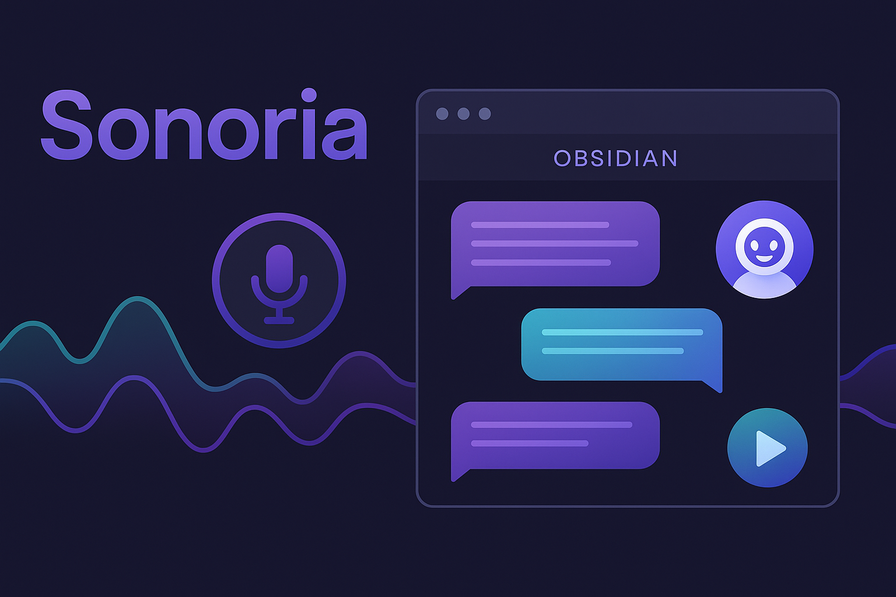

# Sonoria for Obsidian

**We believe the most natural way to interact with your notes is by using your voice.** Sonoria lets you speak a question and hear your vault answer—ideas flow, hands stay free. It listens, thinks with the context you choose, then provides its insight with beautiful voice, weaving capture and conversation into a single, effortless rhythm.

## 🎙️ Beta Release - AI-Driven Voice-First Note Interaction

Sonoria is an **AI-driven plugin** that transforms static notes into intelligent conversation partners. Using advanced AI reasoning combined with natural voice interaction (TTS/STT), Sonoria lets you speak to your notes and hear thoughtful, contextual responses. This beta release focuses on seamless voice-powered knowledge interaction within your Obsidian vault.

## ✨ Features

### Core Voice Interaction
- **🎤 Voice Conversations**: Speak naturally to your notes and hear intelligent responses
- **📝 Text & Voice Input**: Switch seamlessly between typing and speaking
- **🔊 Progressive Text-to-Speech**: Hear responses as they're generated (2-3 second response time)
- **🎯 Context-Aware AI**: AI understands and responds based on your selected notes

### Conversation Modes
- **💬 Text Mode**: Traditional text-based chat with your notes
- **🎙️ Voice Mode**: Continuous voice conversation with automatic speech-to-text and text-to-speech
- **📱 Dictation Mode**: Quick voice input for questions with text responses

### Smart Context Management
- **📚 Multi-Note Context**: Include multiple notes in conversations using the note chip system
- **🔄 Dynamic Context**: Add or remove notes during conversations
- **🎯 File Search Integration**: AI searches through your note content for relevant information

## 🚀 Future Roadmap

Sonoria's development is guided by community feedback and emerging AI capabilities. Here's where we're heading:

### 🤖 AI Model Expansion
- **Current**: Powered by OpenAI's advanced models (GPT-4, Whisper, TTS)
- **Planned**: Support for multiple AI providers including:
  - **Google Gemini** for enhanced reasoning capabilities
  - **Grok** for alternative AI perspectives  
  - **DeepSeek** for specialized thinking tasks
  - **Community Choice**: *What AI models would you like to see supported?*

### 💬 Conversation Evolution
- **Current**: Turn-based conversation with instant voice responses (2-3 seconds)
- **Planned**: Real-time conversation mode with true back-and-forth dialogue
- **Future**: Multi-modal conversations (voice + visual + text simultaneously)

### 🔧 Enhanced AI Context Tools
- **Current**: OpenAI Assistant File Search for note understanding
- **Planned**: Expanded toolkit including:
  - Custom embedding models for better note comprehension
  - Graph-based note relationship analysis
  - Temporal context awareness (note creation/modification dates)
  - Cross-vault knowledge synthesis

### 📱 Platform Expansion
- **Current**: Desktop Obsidian (Windows, macOS, Linux)
- **In Development**: Mobile support for iOS and Android
- **Future**: Web-based note interaction capabilities

### 💡 Community-Driven Features

**We want to hear from you!** Help shape Sonoria's future:
- Which AI models would enhance your workflow?
- What conversation features would be most valuable?
- How would you like to interact with your notes on mobile?
- What unique AI capabilities would transform your note-taking?

*Share your ideas in [GitHub Discussions](https://github.com/Kratos0080/Sonoria/discussions) or create feature requests in [Issues](https://github.com/Kratos0080/Sonoria/issues).*

## 🚀 Installation

### Beta Installation (Manual)

1. Download the latest `sonoria-v0.8.1-beta.zip` from the releases
2. Extract the files to your Obsidian plugins folder: `{vault}/.obsidian/plugins/Sonoria/`
3. Restart Obsidian
4. Enable the plugin in Settings > Community Plugins

## ⚙️ Setup

### Required Configuration

1. **Get an OpenAI API key** from [OpenAI's website](https://platform.openai.com/account/api-keys)
2. Open **Obsidian Settings > Sonoria**
3. Enter your **OpenAI API key**
4. Configure voice settings as desired

### API Key Requirements
- OpenAI API key with access to:
  - GPT-4 models (for conversations)
  - Whisper (for speech-to-speech)
  - TTS (for text-to-speech)

## 📖 Usage

### Starting a Voice Conversation

1. **Open notes** you want to discuss
2. **Click the Sonoria icon** in the ribbon or use the command palette
3. **Add note context** by clicking the "+" button and selecting notes
4. **Switch to Voice Mode** using the voice toggle button
5. **Hold to Talk** - press and hold the microphone button while speaking
6. **Listen to responses** - AI will respond with voice automatically

### Text Conversations

1. Start a conversation as above
2. Stay in **Text Mode** (default)
3. **Type your questions** in the input field
4. **Click play buttons** on AI responses to hear them spoken
5. **Add/remove notes** using the note chip system

### Managing Context

- **Add Notes**: Click the "+" button to browse and add notes to the conversation
- **Remove Notes**: Click the "×" on any note chip to remove it from context
- **Recycle Context**: Use the recycle button to clear all context and start fresh

## 🧪 Beta Testing Focus Areas

We're particularly interested in feedback on:

### Voice Experience
- **Speech recognition accuracy** - How well does it understand your voice?
- **Response timing** - Are the 2-3 second voice responses fast enough?
- **Audio quality** - How do the AI voice responses sound?
- **Voice mode stability** - Any issues with continuous voice conversation?

### Context Management
- **Note selection workflow** - Is adding/removing notes intuitive?
- **AI context understanding** - Does the AI properly use your note content?
- **Multi-note conversations** - How well does it work with multiple notes?

### General Usability
- **Settings simplicity** - Are the configuration options clear?
- **Performance** - Any lag or responsiveness issues?
- **Error handling** - How does it handle network issues or API errors?

## 🐛 Known Beta Limitations

- **Desktop Only**: Currently only works on desktop Obsidian (mobile support planned)
- **OpenAI Dependency**: Requires OpenAI API key and internet connection
- **Voice Quality**: TTS voice options are limited to OpenAI's available voices
- **Context Limits**: Large notes may be truncated due to API limits

## 💬 Feedback & Support

### Reporting Issues
1. Check [GitHub Issues](https://github.com/Kratos0080/Sonoria/issues) for existing reports
2. Create a new issue with:
   - Clear description of the problem
   - Steps to reproduce
   - Your Obsidian version and OS
   - Any error messages from the console

### Feature Requests
We're actively developing Sonoria! Share your ideas:
- [GitHub Discussions](https://github.com/Kratos0080/Sonoria/discussions)
- [GitHub Issues](https://github.com/Kratos0080/Sonoria/issues) (use "enhancement" label)

## 🔒 Privacy & Data

Sonoria prioritizes your data privacy and puts you in complete control of your information:

### Data Storage & Ownership
- **Your OpenAI Account**: When you add notes to conversations, they are uploaded and stored in **your own OpenAI account**, not ours
- **You Own Your Data**: All note content, conversation history, and AI processing happens under your OpenAI API key
- **No Third-Party Access**: We (Sonoria developers) never have access to your notes or conversation data
- **Local Storage Only**: Sonoria only stores conversation metadata locally in your Obsidian vault

### Data Flow & Processing
1. **Note Upload**: Your selected notes are uploaded to OpenAI using your API key
2. **Vector Storage**: Notes are stored in OpenAI's vector stores under your account for AI search
3. **AI Processing**: Conversations happen between you and OpenAI's models using your account
4. **Auto-Cleanup**: Vector stores automatically expire after 1 day of inactivity to minimize storage costs

### Your Responsibilities
- **API Costs**: You pay for all OpenAI usage (storage, processing, API calls) through your account
- **Data Management**: You control what notes to share and when to clear context
- **Privacy Settings**: Your data handling is governed by your agreement with OpenAI
- **Account Security**: Keep your OpenAI API key secure and private

### Data Control & Cleanup
- **Manual Cleanup**: Use the "Recycle Context" button to immediately clear all notes from AI storage
- **Automatic Cleanup**: Unused vector stores self-delete after 24 hours to save costs
- **Note Removal**: Remove individual notes from context to delete them from AI storage
- **Complete Control**: You can monitor and manage all uploaded data through your OpenAI dashboard

### Privacy Compliance
- **Subject to** [OpenAI's privacy policy](https://openai.com/privacy/) and terms of service
- **Your Agreement**: Data handling is governed by your direct relationship with OpenAI
- **No Data Mining**: Sonoria doesn't collect, analyze, or store your personal data

## 🛠️ Development

### Quick Development Setup

```bash
# Clone the repository
git clone https://github.com/Kratos0080/Sonoria.git
cd Sonoria

# Install dependencies
npm install

# Set up your API key (create .env file)
echo "OPENAI_API_KEY=your-api-key-here" > .env

# Build and reload in Obsidian
./dev-complete-reload.sh
```

### Development Commands

```bash
npm run build          # Build the plugin
npm run test           # Run tests
npm run lint           # Check code quality
./dev-complete-reload.sh  # Build and reload in Obsidian
```

## 📄 License

This project is licensed under the MIT License - see the [LICENSE](LICENSE) file for details.

## 🙏 Acknowledgments

- Built for the amazing **Obsidian** platform
- Powered by **OpenAI's** advanced AI models
- Thanks to all **beta testers** and contributors

---

**Ready to give your notes a voice?** Install Sonoria and start the conversation! 🎙️✨ 